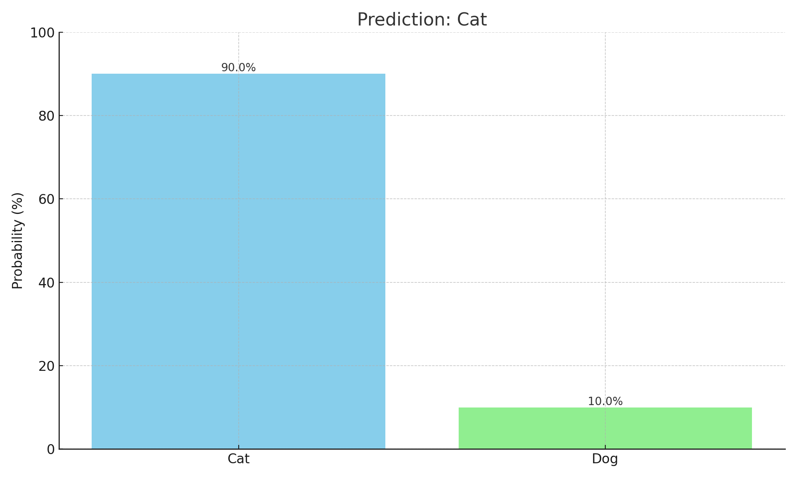

---

# 🐾 Cat vs Dog Image Classifier

> A simple **Machine Learning** project that predicts whether an image contains a **Cat** or a **Dog** 🐱🐶

---

## 📘 Overview

This project demonstrates how a trained classification model can identify whether an input image is of a **cat** or a **dog**.
It includes:

* Image loading and preprocessing
* Prediction using a pre-trained model
* Visualization of the input image and classification probabilities

---

## 🗂️ Project Structure

```
├── SCT_ML_3.py               # Main Python script for prediction
├── cat_image_display.png     # Input image used for testing
├── cat_prediction_result.png # Graph showing predicted probabilities
└── dataset/
    └── test_set/
        ├── cats/
        └── dogs/
```

---

## ⚙️ Installation & Requirements

Install all dependencies using `pip`:

```bash
pip install numpy matplotlib scikit-image scikit-learn
```

You’ll also need a trained model file and a category list such as:

```python
model = trained_model  # Pre-trained model
Categories = ['Cat', 'Dog']
```

---

## 🧩 How It Works

### 🖼 1. Load and Display the Image

```python
path = 'dataset/test_set/dogs/dog.4001.jpg'
img = imread(path)
plt.imshow(img)
plt.axis('off')
plt.show()
```

### 🧮 2. Preprocess the Image

Resize and flatten the image for model input.

```python
img_resize = resize(img, (150, 150, 3))
l = [img_resize.flatten()]
```

### 🤖 3. Predict Using the Model

```python
probability = model.predict_proba(l)

for ind, val in enumerate(Categories):
    print(f'{val} = {probability[0][ind] * 100:.2f}%')

predicted_label = model.predict(l)[0]
print("The predicted image is : " + Categories[predicted_label])
```

---

## 📊 Results

### 🐱 Input Image


### 📈 Prediction Result



**✅ Prediction:** **Cat (90%)**
**❌ Dog:** 10%

---

## 🚀 Future Enhancements

* 🔁 Add more animal categories
* 🧠 Use **Convolutional Neural Networks (CNNs)** for higher accuracy
* 📸 Add real-time webcam image detection
* 🌐 Create a web app using **Flask** or **Streamlit**

---

## 👨‍💻 Author

**Kamalhiiny Gopi**
💼 Passionate about Machine Learning & AI
📧 gkamalhiiny07@gmail.com

---

## ⭐ Show Your Support

If you like this project, give it a ⭐ on GitHub and share it!

---
